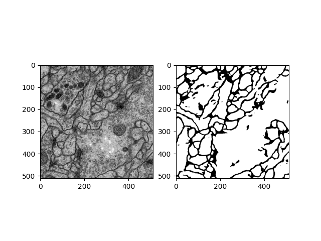
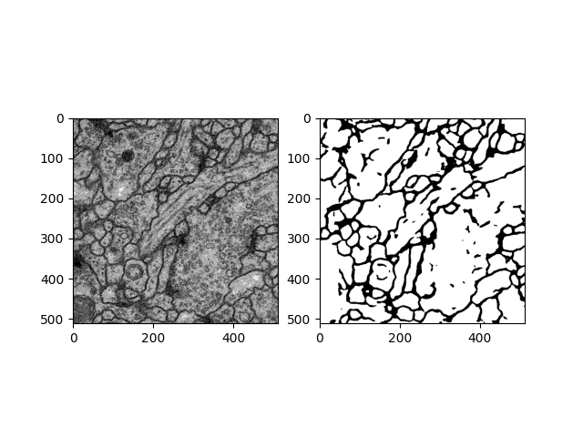

# 🌐 UNet Image Segmentation

Welcome to the **UNet Image Segmentation** project! This repository provides code for training and using a UNet model for image segmentation tasks, following the original paper ["U-Net: Convolutional Networks for Biomedical Image Segmentation"](https://arxiv.org/pdf/1505.04597).

---

## 🌟 Table of Contents

- [Introduction](#introduction)
- [Installation](#installation)
- [Usage](#usage)
  - [Training](#training)
  - [Inference](#inference)
- [Results](#results)
- [Contributing](#contributing)
- [License](#license)

---

## 📖 Introduction

This project implements the **UNet architecture**, inspired by the paper ["U-Net: Convolutional Networks for Biomedical Image Segmentation"](https://arxiv.org/pdf/1505.04597), which pioneered the use of a fully convolutional network for efficient biomedical image segmentation. The UNet model is highly versatile and can be applied to various image segmentation tasks.

> **Note**: While initially developed for biomedical applications, this UNet model is suitable for broader image segmentation challenges as well.

---

## 🚀 Installation

To get started, clone the repository and install the necessary dependencies:

```sh
git clone https://github.com/rk-vashista/unet-image-segmentation.git
cd unet-image-segmentation
pip install -r requirements.txt
```

---

## 🛠️ Usage

### Training
To train the model, use the following command:

```sh
python main.py
```

Hyperparameters such as learning rate, batch size, and epochs can be adjusted in the `main.py` file.

### Inference
Run predictions on images in the `test/` directory:

```sh
python auto.py
```

Alternatively, you can use `single_image_inference` in `metest.py` for a single image:

```python
from metest import single_image_inference
single_image_inference("path/to/your/image.jpg")
```

Segmented outputs will be saved in the `Result/` directory.

---

## 🎨 Results

Example segmented images are saved in the `Result/` directory.

| Segmented Image 1 | Segmented Image 2 |
|-------------------|-------------------|
|  |  |

---

<!-- ## 📂 Pre-Trained Model

Download a sample pre-trained model [here](#) and place it in the `models/` directory for testing.

--- -->

## 🤝 Contributing

Contributions are welcome! Please open an issue for suggestions or bug fixes, or submit a pull request with improvements.

---

## 📄 License

This project is licensed under the MIT License. See the [LICENSE](LICENSE) file for details.

---